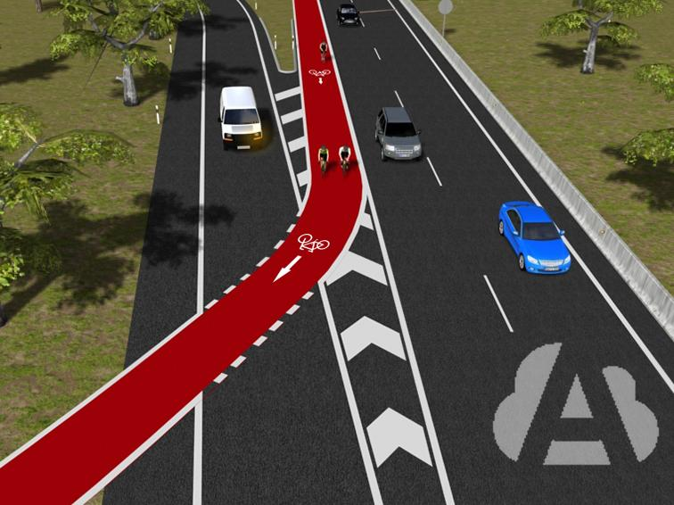
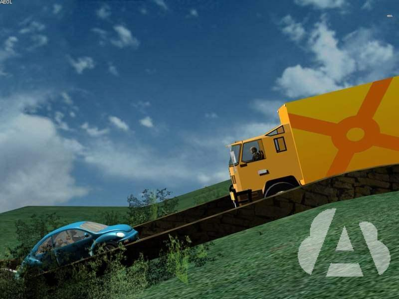

[TOC]

## LOS VEHÍCULOS EN LA VÍA

### conductor

Es la persona que **maneja** el mecanismo de **dirección** o va **al mando** de un **vehículo** o a cuyo **cargo está un animal** o animales.

En **vehículos** que circulan en función de **aprendizaje** de la **conducción**, el **conductor** es la persona que está a **cargo** de los **mandos** adicionales.

### vehículo

Vehículo de **dos** ruedas como **mínimo**, **accionado** por el **esfuerzo muscular** de las personas mediante pedales o manivelas.

### ciclomotores

- **Ciclomotor de dos o tres ruedas.**
- **Ciclomotor de 4 ruedas (Cuadriciclo ligero).**

Vehículo provisto de un motor de **cilindrada** **no superior** a **50 cm³**, si es de combustión interna, y con una **velocidad** máxima por construcción **no superior a 45 km/h.** Su masa en vacío (tara) será inferior o igual a 350 kg sin incluir la masa de las baterías de los vehículos eléctricos.

### motocicleta

Vehículo de **2 ruedas** sin sidecar.

Su motor tiene una **cilindrada superior a 50 cm³** (centímetros cúbicos) si es de combustión interna **y/o,** puede desarrollar una **velocidad** máxima por construcción **superior a 45 km/h.**

**Se considera un automóvil.**

### vehículo derivado de turismo

Automóvil destinado a **servicios o** al **transporte exclusivo de mercancías,** derivado de un turismo del cual conserva la carrocería y solo dispone de **una fila de asientos**.

furgoneta: Automóvil con **cuatro ruedas o más**, concebido y construido para el transporte de **mercancías**, cuya **cabina está integrada** en el resto de la carrocería y con un **máximo de 9 plazas**, incluido el conductor.

### V-26

Un vehículo destinado al alquiler sin conductor que se dedica a un uso concatenado e intensivo por un número indeterminado de usuarios dentro de una zona de servicios delimitada.

**solicitar** **su servicio mediante el empleo de aplicaciones móviles**

# EL USO DE LAS VÍAS

## LOS VEHÍCULOS EN LA VÍA

### curva

Es el tramo en el que la vía cambia de dirección. Se denominan **curvas de visibilidad reducida** cuando **no se ve toda** la **anchura** de la **calzada**, los vehículos que circulan en sentido contrario o no se es visto por los que circulan detrás.

### rasante

坡道 es la inclinación de un tramo de la vía.

**Cambio de rasante**: es el lugar en el que se encuentran **dos tramos** de la vía **con distinta inclinación**. Cuando impide la visibilidad de los vehículos que circulan por la otra rasante, se le denomina **cambio de rasante de visibilidad reducida**.

### apartadero

安全带 es el ensanchamiento de la calzada destinado a la detención de vehículos sin interceptar la circulación de la misma.

### glorieta

环岛 

### autovía

Se **permite** la circulación a...

- Todos los automóviles capaces de alcanzar en llano la velocidad de **60 km/h**.
- Los vehículos especiales:
    - si **superan** las masas y dimensiones establecidas, si lo **indica** su **autorización especial**.
    - si **no superan** dichas masas o dimensiones, si pueden **superar** **en llano** los 60 km/h.

Se **prohíbe** su utilización a los ciclos*, ciclomotores y ciclos de motor, vehículos para personas de movilidad reducida, peatones, animales, vehículos de tracción animal y vehículos de movilidad personal (VMP).

** Los ciclistas **mayores de 14 años** podrán **circular** por los **arcenes** de las **autovías**, **salvo** que en la entrada se encuentren con la señal de **prohibición**.*

Las **autopistas y autovías también pueden discurrir por poblado.**

### borde derecho

Como **norma general**, se circulará por la **calzada** y **no** por el **arcén**, **salvo** por razones de **emergencia**. 

**Especialmente** en **curvas** y **cambios de rasante de visibilidad reducida**, se deberá circular:

- Lo más cerca posible del **borde derecho** de la calzada.

- Manteniendo la **separación lateral** adecuada con los demás.

- Dejando **completamente** **libre** la parte reservada al **sentido contrario**.

El conductor de un **automóvil** o de un **vehículo especial** con MMA **superior** a **3.500 kg**, deberá cumplir las reglas que se citan en los apartados siguientes.

### distancia de seguridad

	¿qué separación lateral debe mantener al cruzarse con otro vehículo?

**La necesaria para realizar el cruce con seguridad.**

**Se debe mantener una separación lateral adecuada siempre, tanto al adelantar como al cruzarse con otros usuarios.**

	El conductor de una motocicleta, ¿puede circular en el mismo carril que la otra motocicleta que está circulando en paralelo?

**No.**

**Todo conductor** que circule con su vehículo detrás de otro, **deberá dejar** entre ambos **un espacio** libre **que le permita detenerse**, en caso de frenado brusco, **sin colisionar** con él, teniendo especialmente en cuenta la velocidad, las condiciones de adherencia y de frenado.

Además, la separación que **debe guardar** todo conductor que circule detrás de otro **sin señalar su propósito de adelantar**, deberá ser tal, que **permita al que le siga adelantarlo con seguridad**.

*Se permite a los conductores de bicicletas circular en grupo sin mantener tal separación, extremando la atención, a fin de evitar alcances entre ellos.*

Guardarán una **separación mínima de 50 metros** los conductores de...

- vehículos con **más de 3.500 kg de MMA** y,

- **vehículos** **y conjuntos** de vehículos de **más de 10 m de longitud**.

### aecén

	En la situación de aglomeración, ¿podrá circular por el arcén?

**No, está prohibido.**

	¿Circula correctamente el tractor agrícola de 2.500 kg de MMA?

**Sí, porque al no superar los 3.500 kg de MMA debe circular por el arcén.**

	¿Puede circular conduciendo un ciclomotor por una vía interurbana sin arcén?

**Sí, por la derecha, ocupando la parte imprescindible de la calzada.**

Deberán circular por el **arcén de la derecha**, o utilizar la parte imprescindible de la calzada, los conductores de:

- **Ciclos** y **ciclomotores**.
- Vehículos de **tracción animal**.
- **Vehículos especiales** con MMA **hasta 3.500 kg**.
- Vehículos para personas de **movilidad reducida**.
- Vehículos en **seguimiento de ciclistas**.

***Los conductores de bicicletas podrán abandonar el arcén** y circular por la parte derecha de la calzada que necesitenen, cuando las razones de seguridad lo permitan, e.g.  los descensos prolongados con curvas.***

Deben circular por el **arcén de la derecha**, o utilizar la parte imprescindible de la calzada, los conductores de:

- **vehículos** cuya **MMA no exceda de 3.500 kg** cuando circulen **por emergencia** a una **velocidad inferior a la mínima** exigida (anormalmente reducida), **perturbando gravemente la circulación.**

***Si no perturban gravemente la circulación circularán por el carril de la derecha***.

**Prohibido** hacerlo **en posición paralela**, salvo los siguientes que podrán marchar en columna de dos:

- Bicicletas, arrimándose al extremo derecho de la vía.

    - No obstante, en tramos sin visibilidad o cuando formen aglomeraciones, deberán colocarse en hilera.
        - En las **autovías, sólo** podrán circular **por el arcén**, sin invadir la calzada en ningún caso.

- Los **ciclomotores**, cuando el arcén sea transitable y suficiente, **sin invadir la calzada en ningún caso**.

Los conductores de vehículos obligados a circular por el arcén, **excepto** las **bicicletas**, tienen **prohibido adelantar** a otro **si** la duración de la marcha **en paralelo supera los 15 segundos o el recorrido de 200 m**.

	Si debido a una avería, un turismo circula a velocidad anormalmente reducida, sin interrumpir la circulación, ¿por dónde debe circular?

**Por la parte derecha de la calzada sin invadir el arcén.**

### tres carriles

Si existen **tres carriles** separados por **marcas** longitudinales **discontinuas**:

- **Circulará** por el carril **derecho** (**nunca** por el **izquierdo**).
- Podrá **utilizar** el carril **central**, **solo** para **adelantar** o **cambiar** de **dirección** a la **izquierda**.

### carriles reservados

Para el cómputo de carriles a efectos de su utilización, no se tendrán en cuenta los carriles **reservados a determinados vehículos o a ciertas maniobras**, los cuales se ajustarán a lo que indiquen las señales correspondientes.

En los tramos de vías interurbanas con pendientes ascendentes pronunciadas, puede existir un carril obligatorio para los vehículos que no alcancen una velocidad determinada.

Las señales indican que **el carril** sobre el que está situada la **señal de velocidad** mínima, **sólo** pueden **utilizarlo** los vehículos que circulen a **velocidad igual o superior** a la indicada, aunque si las circunstancias lo permiten deben **circular por el carril de la DERECHA.**

Esta limitación finaliza con la señal de "Fin de carril" o "Fin de velocidad mínima".

Estos carriles sí se computan a efectos de utilización de la vía.

### carril bus

La señal “carril bus”, indica la **prohibición de circular por ellos** a los conductores de vehículos que **no** sean de **transporte colectivo**. Cuando la señal lleve la palabra “**taxi**”, también les autoriza a utilizar este carril.

Se delimitan con una **línea longitudinal continua sensiblemente más ancha**, salvo en pequeños tramos que es **discontinua** para permitir su **utilización al resto de vehículos,** con el fin de realizar alguna **maniobra** que **no** sea la de **parar**, **estacionar**, **cambiar el sentido** de la marcha o **adelantar**, dando siempre **preferencia** a los **autobuses** y, en su caso, a los **taxis**.

La habilitación o reserva de uno o varios carriles para la circulación de vehículos VAO podrá ser **permanente o temporal**, con **horario fijo** o en **función del estado de la circulación**.

Se consideran **vehículos VAO**, a los **automóviles** destinados **exclusivamente** al transporte de **personas**, cuya MMA no exceda de **3.500 kg** y estén **ocupados** por el **número** de **personas** que se fije para cada tramo.

	¿Está permitido que un turismo utilice un tramo de carril reservado para autobuses, delimitado por línea discontinua?

Sí, para realizar alguna maniobra que no sea parar, estacionar, cambiar de sentido o adelantar.

### carril VAO

La habilitación o reserva de uno o varios carriles para la circulación de vehículos VAO podrá ser **permanente o temporal**, con **horario fijo** o en **función del estado de la circulación**.

Se consideran **vehículos VAO**, a los **automóviles** destinados **exclusivamente** al transporte de **personas**, cuya MMA no exceda de **3.500 kg** y estén **ocupados** por el **número** de **personas** que se fije para cada tramo.

La **utilización** del carril VAO queda **limitada a:**

- **Motocicletas, turismos y vehículos mixtos** adaptables que estén ocupados con las personas que se determine (si el conductor es **minusválido V-15,** puede ir **solo**).

- **Autobuses** con más de 3.500 kg de MMA y **autobuses** **articulados,** si así se indica reglamentariamente, independientemente de los ocupantes.

- Vehículos **prioritarios en servicio de urgencia** y equipos de mantenimiento de la vía.

Tienen **prohibido** utilizarlo el resto de vehículos y conjuntos de vehículos, incluidos los **turismos con remolque, camiones, furgones,** así como los **peatones**, **ciclos, ciclomotores, etc**.

	La habilitación de uno o varios carriles para la circulación VAO, ¿será siempre temporal y con horario fijo?

**No, podrá ser permanente y con un horario en función de las necesidades de la circulación.**

### carril de aceleración

Los carriles de aceleración tienen la misión de **facilitar la incorporación** de los vehículos.

Permiten al conductor **acelerar** para alcanzar la **velocidad adecuada al final del carril** y así **incorporarse con seguridad** a la calzada principal.

### carril reversible

Cuando en una vía de doble sentido de circulación existan **marcas dobles discontinuas delimitando un carril** por ambos lados, **indican que** éste **es reversible**, es decir, que en él la **circulación** puede estar regulada en **uno u otro sentido** con **semáforos de carril** (cuadrados) u otros medios.

Los conductores que circulen por ellos **deberán** llevar encendida, **al menos**, la **luz de corto alcance** o de **cruce** tanto de día como de noche. 

Además, **no** podrán **invadir** el **carril** situado a su **izquierda**.

La velocidad máxima de estos carriles no está limitada, por lo que se podrá circular a la **velocidad máxima de la vía**. **Tampoco existe limitación de uso** por ello lo pueden utilizar todos los conductores.

Entre otras normas, si la circulación está regulada por semáforos de carril, obedecer sus indicaciones.

	El carril reversible está abierto. ¿Puede atravesar la línea doble discontinua de la izquierda para adelantar?

No.

### carril adicional

En las calzadas con **doble sentido** de circulación y **arcenes**, si la anchura de la plataforma lo permite, se podrá habilitar un **carril adicional** en uno de los sentidos mediante el uso de ambos arcenes y de las señales adecuadas. Con la habilitación de este carril se dispone de 2 carriles en un sentido y 1 en el otro.

**Todos** los vehículos que utilicen esta vía **circularán**:

- Con las marcas longitudinales entre las ruedas.

- Llevando encendida, **al menos**, la **luz** de corto alcance o **cruce,** tanto de día como de noche.

- A una velocidad **máxima** de **80 km/h** y a una **mínima** de **60 km/h**, **o inferiores** si estuviera establecido o específicamente señalizado.

- **Sin atravesar** ni **alterar** la línea que forman los elementos de **balizamiento** (conos, balizas, etc.).

    	Los conos de la fotografía indican que se ha habilitado...

un carril adicional circunstancial.

	En esta vía se ha habilitado un carril adicional. ¿Circula correctamente el turismo amarillo?

No, porque no lleva encendida, al menos, la luz de cruce.

##  LOS PEATONES Y LOS ANIMALES EN LA VÍA.

### peatones

	En una vía fuera de poblado que no disponga de zona peatonal, como norma general, ¿por qué lado deben circular los peatones?

**Por su izquierda.**

	Una persona en silla de ruedas, ¿puede circular por una carretera?

**Sí, por el arcén si es transitable y, si no lo es, por la calzada.**

	Un peatón que empuja un carrito, ¿por dónde puede circular?

**Por la zona peatonal, o por el arcén o la calzada si pudiera obstaculizar el paso.**

	Cuando no exista zona peatonal o ésta no sea practicable, los peatones, ¿pueden circular por el arcén?

**Sí, o en su defecto, por la calzada.**

Los **peatones** que **circulen** por la **calzada o arcén** de una vía situada **fuera de poblado**, entre el ocaso y la salida del sol o en condiciones meteorológicas o ambientales que **disminuyan sensiblemente la visibilidad**, **deberán llevar** un **elemento luminoso o retrorreflectante** homologado que sea **visible a** una distancia mínima de **150 metros**.

Como norma general, los **peatones** tienen **prohibido** circular por autopistas y autovías. Únicamente **pueden** transitar por ellas los **ocupantes** o servidores de los vehículos **de servicios de urgencia o especiales**, cuando sea estrictamente indispensable y adopten las medidas de seguridad oportunas.

Los **conductores** que circulen por autopistas o autovías **deberán hacer caso omiso** de las **peticiones de pasaje** (auto-stop) que reciban en cualquier tramo de ellas, incluidas las explanadas de las estaciones de peaje.

Los peatones que utilicen **monopatines**, **patines** o aparatos **similares** **no** podrán circular por la **calzada**, **salvo** que se trate de **zonas, vías o partes** de las mismas que les estén **especialmente destinadas** y sólo podrán circular **a paso de persona por las aceras o calles residenciales** debidamente señalizadas, sin que **en ningún caso** se permita que sean **arrastrados por** otros **vehículos**.

Ningún peatón debe permanecer detenido en la calzada ni en el arcén cuando existan refugios, zonas peatonales u otros espacios adecuados, aunque sea en espera de un vehículo o para subir a éste. Solo podrán invadirlas cuando el vehículo esté a su altura.

Para **atravesar** la **calzada fuera** de un **paso para peatones**, deben cerciorarse de que pueden **hacerlo sin riesgo ni entorpecimiento**.

Al atravesar la calzada, **deberán caminar perpendicularmente al eje de ésta**, sin detenerse ni entorpecer el paso a los demás.

Los **peatones** tienen **prohibido atravesar** las **plazas** y **glorietas** por su calzada, deben rodearlas.

### mascota

	Cuando viaje con su mascota, ¿en qué lugar del vehículo podrá situarla para evitar que interfiera en la conducción?

**Donde no comprometa su seguridad ni la del resto de pasajeros, además de ir sujeta con el dispositivo adecuado.**

## VELOCIDAD EN VIAS SITUADOS FUERA DE POBLADO

### Autopista y autovía

Máximo: 120, 100, 90

Mínimo: 60

### carretera convencional y vía de automóvil

Máximo: 90, 90, 80

Mínimo: 45, 45, 40

	¿A qué velocidad puede circular un turismo con remolque por una carretera con un arcén de 1,50 metros de ancho?

**80 km/h.**

## VELOCIDAD SITUADAS DENTRO DE POBLADO

El límite genérico de velocidad **en travesías es de 50 km/h para todo tipo de vehículos**. Este límite **podrá ser rebajado** por acuerdo de la Autoridad Municipal con el titular de la vía, previa señalización especifica.

- ehículo de tres ruedas y cuadriciclos: **máximo** 70 km/h.
- ciclos y TODOS los ciclomotores (de dos y tres ruedas, cuadriciclos ligeros y movididad reducida): **máximo** 45 km/h.
- motocicletas, vehículos de tres ruedas, ciclos y ciclomotores, que arrastren remolque o semirremolque: un 10 % menos de su velocidad máxima.
- vehículos especiales: **máximo** 40 km/h
- en carretera convencional, autobuses: **máximo** 80 km/h
- **Las bicicletas podrán superar la velocidad de 45 km/h en tramos en los que las circunstancias de la vía permitan desarrollar una velocidad superior.**

Estas velocidades **podrán ser rebajadas previa señalización específica**, por la Autoridad municipal.

	Un autobús realiza transporte urbano. ¿Cuál es su velocidad máxima permitida dentro de poblado en vías de dos carriles por sentido?

**50 kilómetros por hora.**

	Es importante no superar los 50 km/h en las ciudades porque en ellas los peatones...

**comparten los espacios con los mismos derechos que los vehículos.**

### vías que dispongan de plataforma única

Máximo: 20

### vías de un único carril y vía sin pavimentar

Máximo: 30

***Excepcionalmente**, la Autoridad Municipal **podrá aumentar la velocidad en vías de un único carril por sentido hasta una velocidad máxima de 50 km/h**, previa señalización específica.*

### vías de dos o más carriles

Máximo: 50

Mínimo: 25

### autopistas y autovías que transcurren dentro de poblado

Máximo: 80 

Mínimo: 60 

***Podrá ser ampliado** por acuerdo de la Autoridad Municipal y el titular de la vía, previa señalización específica, **sin rebasar en ningún caso los límites genéricos** establecidos **para dichas vías** fuera de poblado.***

## VELOCIDAD DE DISEÑO

Los **límites de velocidad** no son fruto del azar. Detrás de cada uno existe una serie de criterios técnicos que los justifican, como la velocidad de diseño de la vía, el grado aceptable de congestión, las demandas de tráfico, el impacto ambiental y ecológico, etc., y cuyo **objetivo** es que los vehículos se desplacen con la **máxima garantía de seguridad y fluidez**.

**Velocidad excesiva** es cuando el conductor circula a una velocidad superior a la máxima permitida, circula con un **exceso de velocidad**.

**Velocidad anormalmente reducida** es cuando circula a una velocidad inferior a la mínima permitida.

## VELOCIDAD ADECUADA A LAS CIRCUNSTANCIAS

Se circulará a **velocidad moderada y** si fuera preciso se **detendrá el vehículo**:

1. Cuando las **circunstancias no permitan realizar el cruce con seguridad**.
2. **Fuera de poblado,** al **acercarse a vehículos inmovilizados** en la calzada o a vehículos de auxilio prestando servicio.
3. En **caso de deslumbramiento**, para evitar el alcance de vehículos o peatones que circulen en el mismo sentido.

Se circulará a **velocidad moderada y** si fuera preciso se **detendrá el vehículo**:

1. Al aproximarse a **pasos para ciclistas**.
2. Al aproximarse a un **paso a nivel o** a un **puente móvil**.
3. Al aproximarse a **glorietas**.
4. Al aproximarse **a pasos de peatones no regulados ni por semáforo ni por agentes**.
5. Al aproximarse a **estrechamientos**.
6. Al aproximarse a **intersecciones en las que no tenga prioridad**. Si las **intersecciones sin prioridad** están debidamente **señalizadas** y la **visibilidad** es prácticamente **nula**, se **prohíbe superar** la velocidad de **50 km/h**.

	Cuando se aproxima a un puente móvil, ¿qué debe hacer?

**Reducir la velocidad por debajo de la máxima permitida.**

Salvo en caso de inminente peligro, el conductor que quiera reducir considerablemente la velocidad de su vehículo, deberá **observar** por el **espejo interior, la distancia y velocidad** a la que se acercan los **vehículos** que **circulan detrás** del suyo.

Deberá **advertirlo** siempre que sea posible, mediante el empleo reiterado de las **luces de frenado, o** moviendo el **brazo** alternativamente de arriba abajo con movimientos cortos y rápidos.

A continuación se debe **reducir la velocidad sin brusquedades**, para que no produzca riesgo de colisión con los vehículos que circulan detrás del suyo.

Se **prohíbe** realizar **competiciones** de **velocidad** en las **vías públicas**, **salvo** que la autoridad competente conceda la **autorización** correspondiente **y** se **acondicione** la **zona** para ello.

La celebración de una actividad de **más de 50 ciclistas** se considera una **marcha ciclista organizada** y requiere **autorización previa**.

	¿Está permitido realizar competiciones de velocidad en las vías públicas?
**Sí, en vías acotadas para ello por la autoridad competente.**

## PRIORIDAD

### vehículos

Los vehículos que circulan por **raíles tienen prioridad** de paso sobre los demás usuarios (el tren siempre).

No obstante, en los cruces **con tranvías**, **pueden** **existir señales** que regulen la prioridad **a favor** de los **conductores**.

**Aun** cuando **goce de prioridad** de paso, **ningún conductor** deberá **penetrar** en una intersección, en un **paso para peatones** o en un **paso para ciclistas**, **si** la situación de la circulación es tal que, previsiblemente **pueda quedar** **detenido** de forma que **impida** u obstruya la **circulación transversal**.

Si esto ocurre, el conductor que tenga **detenido** su **vehículo** en una **intersección** regulada por **semáforos** y su situación **sea** un **obstáculo** para la circulación, **deberá salir** **de aquélla sin esperar a que se permita la circulación en la dirección que se propone tomar**, siempre que al hacerlo no entorpezca la marcha de los que avancen en sentido permitido.

### paso a nivel o puente móvil

**Queda prohibido** **penetrar** en un **paso a nivel o puente móvil** cuyas barreras o semibarreras estén **atravesadas o en movimiento**, **o** cuando las indicaciones de sus **semáforos** **impidan** el paso. En estos casos los vehículos **deberán** **detenerse uno detrás de otro** en el carril correspondiente hasta que tengan paso libre.

**Si** en un paso a nivel **no existieran barreras, semibarreras o semáforos**, ningún usuario de la vía deberá **penetrar** en él sin antes haberse asegurado de que **no se acerca ningún vehículo** que circule sobre raíles.

**El cruce** de la vía férrea **deberá realizarse sin demora** **y** después de haberse asegurado de que, por las circunstancias de la circulación o por otras causas, **no existe** **riesgo** **de quedar** **inmovilizado dentro** del paso.

### ciclistas

Los conductores de vehículos a motor tienen que **ceder el paso a los ciclistas**:

1. Cuando **atraviesen** un **carril-bici, paso para ciclistas** o **arcén** debidamente **señalizado**.
2. Cuando giren para **entrar en otra vía y haya** un **ciclista** en las **proximidades** de la intersección.
3. Cuando circulen **en grupo** y el **primero haya iniciado** **el cruce** o haya entrado en una glorieta. Cuando circulen en grupo se les considera como una única unidad móvil.
4. Cuando se tengan que aplicar las **normas generales** sobre **prioridad de paso** entre vehículos (ceder el paso a la **derecha** como norma general).

### peatones

Los conductores tienen prioridad de paso para sus vehículos, respecto a los peatones, salvo en los siguientes casos en los que deben **ceder el paso a los peatones**:

1. En los **pasos para peatones** debidamente señalizados.
2. Cuando giren con su vehículo para **entrar en otra vía** y haya peatones cruzándola, aunque **no exista paso** para éstos.
3. Cuando el vehículo **cruce un arcén** por el que estén circulando peatones que no dispongan de zona peatonal.
4. Cuando **crucen las zonas peatonales** por los pasos habilitados al efecto.
5. Cuando vayan a subir o hayan bajado de un vehículo de transporte colectivo de viajeros, en una parada señalizada, y estén entre el vehículo y la zona peatonal o refugio más cercano.
6. Cuando los peatones constituyan **una tropa en formación**, una fila escolar o una comitiva organizada.

	Sí, debido a la situación del tráfico, prevé que puede quedar detenido en una intersección obstaculizando la circulación transversal, ¿qué debe hacer?
**Detener el vehículo antes de entrar en la intersección.**

	En una intersección donde no esté señalizada la prioridad, ¿debe ceder el paso a un tranvía?
**Sí, el tranvía tiene prioridad tanto si se aproxima por la derecha como por la izquierda.**

	Al aproximarse a un puente móvil, ¿qué están obligados a hacer los conductores?
**Extremar la prudencia y reducir la velocidad por debajo de la máxima permitida.**

	Un grupo de ciclistas se aproxima por su izquierda a una intersección sin señalizar y el primero ha entrado ya en el cruce; ¿debe ceder el paso al grupo de ciclistas?
**Sí, siempre.**

	Para incorporarse a la vía principal, un turismo tiene que atravesar un carril bici debidamente señalizado; ¿deberá ceder el paso a los ciclistas que circulan por el mismo?
**Sí; los ciclistas tienen prioridad de paso.**

### animales

Los conductores tienen prioridad de paso para sus vehículos, respecto de los animales, salvo en los siguientes casos en los que deben **ceder el paso** a los **animales:**

1. En las **cañadas debidamente señalizadas**.
2. Cuando vayan a girar con su vehículo para **entrar en otra vía** y haya animales cruzándola, aunque no exista paso para ellos.
3. Cuando el vehículo **cruce un arcén** por el que estén circulando animales que no dispongan de cañada.

*Para que las cañadas o pasos de ganado estén bien señalizados, deberán tener la señal P-23 "Paso de animales domésticos" y un panel complementario colocado debajo de la señal con la inscripción "Cañada". Dicha señalización debe estar complementada con las correspondientes señales de limitación de velocidad.*

### puentes

El orden de **preferencia de paso** por puentes u obras de paso cuya anchura no permita el cruce de vehículos, se realizará conforme a la **señalización** que lo regule. 

En el caso de que en uno de los extremos del estrechamiento estuviera colocada la señal de prioridad en sentido contrario o la de ceda el paso, el que llegue por ese extremo **tendrá que retroceder** para dejar pasar al otro **en el caso de que no puedan cruzarse.**

En ausencia de señalización, el **orden de preferencia de paso** entre los distintos vehículos se realizará de acuerdo con el orden establecido para los **estrechamientos**.

Los **vehículos** que **necesitan autorización especial** para circular, **no** podrán **cruzarse** en los **puentes si el ancho de la calzada es inferior a 6 metros,** de suerte que para cada vehículo pueda contarse con un ancho de vía no inferior a 3 metros. En caso de encuentro o cruce entre dichos vehículos el orden de preferencia se establecerá de acuerdo con lo indicado anteriormente.

### pendiente

Se entiende por **tramos** de gran **pendiente** los que tienen una **inclinación mínima del 7%**.

En los estrechamientos situados en tramos de gran pendiente, tendrá **preferencia de paso** el vehículo que **circule en sentido ascendente**, **salvo que** este pudiera llegar antes a un apartadero establecido al efecto.

En caso de duda sobre la inclinación de la pendiente o la distancia al apartadero, se aplicarán las normas indicadas para los estrechamientos de la calzada.

	Como norma general, en un tramo de vía estrecho de gran pendiente debe ceder el paso...
**el vehículo que baja.**

