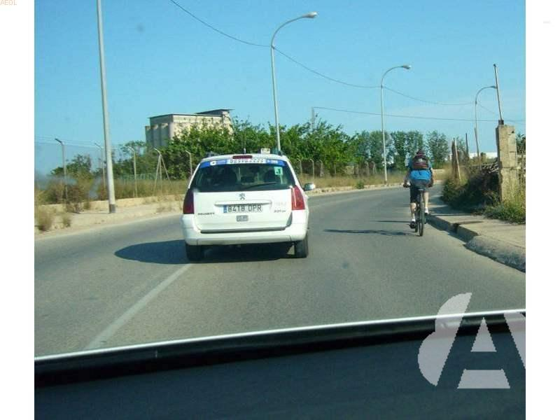
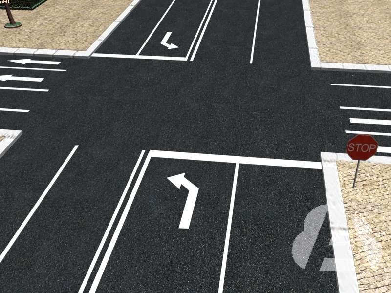

## LAS MANIOBRAS NORMAS GENERALES

**Antes** de realizar **cualquier maniobra**, el **conductor** debe **indicar su intención** de forma **clara** y con suficiente **antelación**, para facilitar al resto de usuarios su entendimiento y darles tiempo para adaptar su comportamiento.

Para cumplir con esta obligación el conductor **utilizará:**

- Los **indicadores de dirección (intermitentes)** del vehículo, que se mantendrán encendidos todo el tiempo que dure la maniobra y se quitarán en cuanto se termine.

- En su defecto, el **brazo.**


		¿Está permitido advertir con el brazo que va a efectuar una maniobra?

**Sí, cuando la señal sea perceptible para los demás usuarios.**

	Quiere girar a la derecha. ¿Cómo debe avisar a los demás conductores?

**Con el intermitente o con el brazo.**

### hacia la izquierda

El **desplazamiento lateral** **y** el **cambio** de **dirección,** ambos hacia la **izquierda**, se señaliza con:

- el **intermitente izquierdo** o,

- el **brazo izquierdo** en posición **horizontal** con la **palma** de la mano hacia **abajo**.

También se deben realizar estas señales para realizar la maniobra de cambio de sentido de la marcha.

### hacia la derecha

El **desplazamiento lateral** **y** el **cambio** de **dirección,** ambos hacia la **derecha**, se señaliza con:

- el **intermitente derecho** o,

- el **brazo izquierdo doblado** y la **palma** de la mano extendida **hacia** **delante**.


	¿Está permitido advertir con el brazo que va a efectuar una maniobra?

**Sí, cuando la señal sea perceptible para los demás usuarios.**

### marcha atrás

La **marcha atrás** se señaliza con:


- la **luz** de marcha atrás o,
- el **brazo** en posición **horizontal** y con la **palma** de la mano **hacia atrás**.


	Cuando la luz de marcha atrás esté averiada, ¿cómo debe indicar que va a dar marcha atrás?

**Con el brazo extendido y la palma de la mano hacia atrás.**


### claxon

Excepcionalmente, se podrán realizar señales acústicas para **advertir** de la presencia del vehículo a los demás usuarios de la vía. Un tipo de señal acústica es el claxon.

El **sonido** del claxon será **uniforme** y de **suficiente intensidad** (nunca estridente), para que sea percibido por los demás usuarios.


Queda **prohibido** que el claxon emita **notas musicales** variadas y cualquier **tono que puedan inducir a confusión** sobre la naturaleza del vehículo, quedando prohibido utilizar aparatos de señales acústicas especiales, cuyo uso está reservado exclusivamente para vehículos prioritarios debidamente autorizados.


**Las advertencias acústicas solo se podrán utilizar** (vehículos no prioritarios)...

- **Tanto dentro como fuera de poblado;** para **evitar** un posible **accidente** o **atropello**, cuando se realice un **servicio** de **urgencia** y de modo especial, en **vías estrechas** con **muchas curvas**.

- Únicamente **fuera de poblado;** para **advertir** la **intención** de **adelantar**.

El uso del claxon está limitado porque **produce contaminación acústica**, pudiendo llegar a provocar alteraciones nerviosas a las personas que están expuestas a altos niveles de ruido durante cierto tiempo (atascos, obras, etc). Por ello, **debe utilizarse** de forma **suave**, con **toques cortos** y **breves**, quedando **prohibido** su **uso inmotivado**, exagerado o con fines distintos a los relacionados con el tráfico (saludar, recriminar, etc).

	Deberán emplearse señales acústicas...

**de sonido no estridente.**


##  INCORPORACIÓN A LA CIRCULACIÓN.

Los conductores que vean a otro intentando incorporarse a la circulación, **deberán facilitarle la maniobra en la medida de lo posible**, principalmente si se trata de un vehículo de **transporte** colectivo de **viajeros** que pretende incorporarse **desde** una **parada señalizada**.


	Si observa que un vehículo quiere incorporarse por el carril de aceleración, ¿qué debe hacer?

**Facilitarle la incorporación en la medida de lo posible.**

	El conductor de un vehículo pretende incorporarse a la circulación, ¿debe cerciorarse previamente de que puede hacerlo sin peligro?
**Sí, incluso siguiendo las indicaciones de otra persona en caso necesario.**

## DESPLAZAMIENTO LATERAL

Como en todas las maniobras los pasos a seguir son:


1º **Observar** minuciosamente que puede hacerlo sin entorpecer ni poner en peligro a los demás usuarios.

2º **Señalizar** después de comprobar que se puede realizar la maniobra, con el intermitente o el brazo en la posición correspondiente. Debe dejar de señalizar cuando el vehículo se encuentre en la posición adecuada.

3º **Realizar** la maniobra:

- Teniendo en cuenta que los vehículos que circulan por el carril al que se quiera desplazar, tienen preferencia y **debe cederles el paso**.
- Empezando el desplazamiento **con** suficiente **antelación y sin volantazos** (progresivamente).
- **Sin entorpecer la marcha** del resto de vehículos.

### proporcional

Cuando se adelante **a cualquier otro vehículo** o la maniobra se realice **dentro de poblado**, se dejará un **margen lateral** de seguridad **proporcional** a la velocidad a la que se circule, anchura y características de la calzada.

### 1,50 metros

Cuando adelante **fuera de poblado a los usuarios más frágiles** (peatones, animales, vehículos de dos ruedas o de tracción animal), **a vehículos inmovilizados en la vía o a los vehículos de auxilio cuando estén realizando operaciones de auxilio y rescate,** se deberá realizar la maniobra **ocupando parte o la totalidad del carril contiguo** de la calzada, siempre y cuando se den las condiciones necesarias para realizarla; en todo caso, **la separación lateral no será inferior a 1,50 metros.**

- **Los** conductores de **vehículos de dos ruedas** que adelanten **fuera de poblado** a otro cualquiera, lo harán de forma que entre aquél y la parte más saliente del vehículo que adelantan, quede una **separación** lateral que **no** sea **inferior a 1,50 metros.**


	Un vehículo va a incorporarse a la circulación. ¿Cuándo debe ceder el paso?

**Siempre**.

	Desde un camino privado se incorpora a la calzada, ¿a qué velocidad debe hacerlo?

**A la que me permita ceder el paso a los vehículos que circulan por la calzada.**

	En los cambios de carril en un mismo sentido, ¿quién tiene prioridad?

**El vehículo que circula por el carril que se pretende ocupar.**


### carril de aceleración

Cuando la **incorporación** se realice utilizando un **carril de aceleración**, el conductor deberá:


1. **Asegurarse** al principio del carril de que puede hacerlo sin peligro.
2. **Ceder el paso** a los que circulen por la vía a la que pretende incorporarse, llegando a **detenerse**, si fuera necesario, **al principio del carril**.
3. **Acelerar** hasta alcanzar la velocidad adecuada al final del carril para incorporarse a la vía sin peligro.

*Es importante tomar la decisión al principio del carril, ya que cuanto más avance, menos espacio quedará para acelerar y adecuar la velocidad a la del resto de vehículos.*


	Para incorporarse a una vía por un carril de aceleración, ¿en qué punto debe cerciorarse de que puede realizar la maniobra sin peligro?

**Al principio del carril de aceleración.**

	En un carril de aceleración, ¿dónde debe detenerse de tener que ceder el paso?

**Al principio del carril.**


## ADELANTAMIENTO NORMAS GENERALES

El Reglamento de Circulación indica que como norma general el adelantamiento a otros vehículos deberá hacerse por la izquierda. **Excepcionalmente**, se adelantará **por la derecha**, si existe espacio suficiente y con la máxima precaución:

- **A los vehículos que estén indicando** claramente su propósito de **cambiar de dirección a la izquierda o parar** en ese lado.
- **Dentro de poblado**, en vías que tengan **por lo menos dos carriles** para el **mismo sentido**, **delimitados** por marcas longitudinales.
- Cuando se circule por una vía de **doble sentido** y existan **tranvías que circulen por el centro** de la calzada.

**Durante la ejecución** del adelantamiento, el conductor deberá llevar su vehículo a una **velocidad notoriamente superior** a la del vehículo que pretende adelantar. Si **después de iniciar** el adelantamiento se produce alguna situación de peligro, se deberá **reducir** rápidamente **la velocidad y regresar** al carril de la derecha, utilizando para ello la señalización que en cada caso corresponda.

Una vez **terminado** el adelantamiento, se debe **volver** al **carril** de la **derecha** tan pronto como sea posible y de forma gradual, sin obligar a otros usuarios a modificar su trayectoria o velocidad (cuando vea por los espejos al vehículo adelantado).


### **nuevo** adelantamiento

En las calzadas que tengan **por lo menos dos carriles** en el **sentido de su marcha**, el conductor que vaya a realizar un **nuevo** adelantamiento, **podrá permanecer en el carril** que haya utilizado para el anterior, a condición de asegurarse de que puede hacerlo **sin molestar** indebidamente **a los conductores que circulen detrás** de su vehículo más velozmente.


```
Este vehículo va a girar a la izquierda, ¿está permitido adelantarle por la derecha?
```

**Sí, porque está indicando claramente su propósito de girar a la izquierda**


```
Un vehículo circula por el carril izquierdo, ¿está permitido adelantarle por la derecha?
```

**Sí, cuando los carriles están delimitados y la vía está dentro de poblado.**


```
A la vista de la imagen, ¿es obligatorio adelantar al tranvía por la derecha?
```

**No, se le puede adelantar por la derecha o por la izquierda.**


```
El vehículo rojo, ¿debe apartarse a la derecha cuando termine el adelantamiento?
```

**Sí, para no obstaculizar al vehículo que le sigue.**


	Al adelantar. ¿Cuándo debe volver al carril derecho?
**Tan pronto como sea posible y sin molestar al vehículo adelantado.**

	Cuando supere al turismo rojo, el conductor del vehículo gris no va a seguir adelantando, ¿puede permanecer en el carril izquierdo?

**No, debe incorporarse al carril de la derecha.**


	Si se encuentra con un ciclista circulando en sentido contrario, ¿qué debe hacer?
**No iniciar ni continuar un adelantamiento.**

	Al adelantar a un peatón, es obligatorio dejar una separación lateral mínima de 1,50 metros cuando circule...

**en vías interurbanas, solamente.**

### queda prohibido cuando...

Aunque no exista señal, está **prohibido** adelantar en **túneles, pasos inferiores y tramos con la señal túnel**, si **sólo** tienen **un carril** para **su sentido** de circulación.

Aunque no exista señal, está **prohibido** adelantar en las **intersecciones** y en sus proximidades, **salvo** que adelante:


- **Por la derecha**, según lo comentado en el punto 3.3.
- En **intersecciones** en las que tenga **prioridad y exista señal** que lo indique.
- A **vehículos de dos ruedas**.
- En **glorietas y en plazas** de circulación giratoria.

Aunque esté prohibido adelantar, se **podrá ocupar** la parte reservada a la circulación en **sentido contrario aunque la línea sea continua**, para:

- **Adelantar a los usuarios más lentos y frágiles** (ciclos, ciclomotores, peatones, animales y vehículos de tracción animal), cuando su velocidad permita realizar la maniobra **sin riesgo** para ellos ni para la circulación en general.

Rebasar a vehículos inmovilizados que ocupen su carril (averiados, accidentados, etc), después de asegurarse que no existe **peligro** (**si** el motivo de **la inmovilización** viene impuesto **por las necesidades del tráfico**, **no podrá rebasarlo**, debiendo quedarse detrás de él).

Queda expresamente prohibido adelantar poniendo **en peligro** o entorpeciendo a ciclistas que circulen en **sentido contrario**, incluso si estos ciclistas circulan por el arcén.


	¿Es correcto este adelantamiento?

**Sí, porque el turismo ocupa parte del sentido contrario y deja más de 1,50 metros de separación con el ciclista.**



		En las glorietas, ¿está permitido adelantar?
**Sí.**

	En esta vía de doble sentido, el vehículo rojo, ¿adelanta correctamente?
**No, porque la calzada no tiene prioridad en la intersección.**


##  CAMBIO DE SENTIDO

1° **Observar** que se puede realizar sin entorpecer ni poner en peligro a los demás usuarios, absteniéndose de realizar la maniobra de no darse estas circunstancias.


2° **Señalizar** la intención de frenar la marcha y los desplazamientos laterales, con los dispositivos luminosos o el brazo.


3° **Realizar** la maniobra teniendo en cuenta que:

- Se debe **elegir un lugar adecuado** para hacer el cambio de sentido de forma que se intercepte la vía el menor tiempo posible asegurándose de que no se va a poner en peligro u obstaculizar a otros usuarios.
- Cuando su permanencia en la calzada impida continuar la marcha de los vehículos que circulan detrás del suyo, **deberá salir de ella por su lado derecho, si fuera posible**, hasta que las condiciones de la circulación le permitan efectuarlo.
    - Si no puede salir al arcén, busque otro lugar en el que no dificulte la circulación.


Se **recomienda** cambiar el sentido en:

- Las glorietas, donde se deben rodear por la derecha, dejando su centro a la izquierda.
- Las glorietas **partidas,** donde después de salir por la derecha, puede terminar la maniobra por la calzada principal o rodeando la otra isleta.
- Cualquier otro **lugar** **habilitado,** en cualquier caso se deberán obedecer las indicaciones de las señales.


	El vehículo toma la calzada de la derecha para hacer un cambio de sentido. ¿Es correcto que lo haga por la calzada principal?
**Sí, porque no hay señal que lo prohíba.**


### queda prohibido cuando...

Como norma general, donde está **prohibido adelantar** también se **prohíbe cambiar** el **sentido** de la marcha.

Otros lugares prohibidos:

1º Cuando **no** exista una **visibilidad suficiente** para poder realizar la maniobra con seguridad (curvas y cambios de rasante de visibilidad reducida, cuando las condiciones meteorológicas o ambientales disminuyen la visibilidad, etc.).

2º En **túneles**, **pasos inferiores** y demás **tramos** señalizados con la señal túnel (S-5).

3º En los **pasos a nivel**.

4º En los **pasos para peatones**, en las **intersecciones** con **vías ciclistas** y en las proximidades de ambos.

5º En las **intersecciones y** en sus **proximidades**, salvo:

- En **glorietas y plazas de circulación giratoria**.
- **Intersecciones** en las que se **tenga prioridad** y haya señal que lo indique.


Se **prohíbe cambiar** el **sentido** de la marcha en **autopistas y autovías**, **salvo** **en los lugares habilitados para hacerlo a distinto nivel** (por arriba: paso superior; por abajo: paso inferior). **No** se pueden atravesar los pasos abiertos de la mediana.


	Cuando para realizar un cambio de sentido obstaculiza la marcha de los vehículos que circulan detrás, deberá...

**salir de la** **calzada** **por la derecha, y** **esperar** **hasta** **que las condiciones permitan** **hacer** **la maniobra.**


	Debido a la estrechez de la calzada, el cambio de sentido no puede realizarse de un solo giro, ¿qué está obligado a hacer el conductor?

**Continuar la marcha hasta encontrar un lugar adecuado.**

	En una intersección, ¿está permitido realizar un cambio de sentido?
**No, como norma general.**



	Debe abstenerse de realizar un cambio de sentido cuando...

**la vía sea de sentido único.**

	Como norma general, está prohibido cambiar el sentido de la marcha cuando...
**está prohibido adelantar, salvo que el cambio de sentido esté autorizado.**


## INMOVILIZACIÓN 

**Se pueden hacer tres tipos de inmovilizaciones:**

**Detención** (no se considera maniobra). Inmovilización accidental o momentánea:

- Por **emergencia**.

- Por **necesidades de la circulación**.

- Para **cumplir con las normas o señales** (olvido del cinturón, regulación de espejos, stop, semáforos, Agentes, etc).

**Parada**. Inmovilización voluntaria:

- Por un **tiempo inferior a dos minutos**.

- **Sin que el conductor abandone el vehículo** (no es necesario que esté dentro de él).

**Estacionamiento**.

- **Inmovilización voluntaria** de un vehículo que **no se encuentra en** situación de **parada**.


### accidente o avería

Si por causa de **accidente o** **avería, el vehículo o su carga** **obstaculizan la calzada**, **el conductor**, **tras señalizar convenientemente el vehículo o el obstáculo creado,** adoptará las medidas necesarias para que sea retirado en el menor tiempo posible. Deberá **colocarlo fuera de la calzada** y situarlo **cumpliendo** las **normas de estacionamiento** siempre que sea posible.

Aquellos vehículos que **puedan continuar su marcha,** lo harán de forma inmediata, asegurándose de circular con seguridad. Si precisaran de un **servicio de auxilio**, deberán **abandonar lo antes posible los carriles de circulación y dirigirse hacia la primera salida disponible** utilizando para ello el **arcén derecho** de la vía. Si ello no fuera posible, deberán detenerse en dicho arcén o en el lugar donde cause menor obstáculo a la circulación.

**En el caso de accidente o avería**, como norma general, si el vehículo está inmovilizado sin posibilidad de reemprender la marcha, **los ocupantes deberán abandonar el vehículo** con seguridad, siempre que exista un lugar seguro fuera de la plataforma de circulación y, en todo caso, deberán salir de él por el lado contrario al flujo de tráfico **sin transitar o permanecer** en los carriles y arcenes que conforman dicha plataforma. **Si las condiciones de circulación no lo permitieran, permanecerán en el habitáculo con el cinturón abrochado.**

**El conductor deberá** utilizar el **chaleco reflectante** de alta visibilidad, **cuando salga del vehículo** y ocupe la **calzada o el arcén de una vía interurbana.** No obstante, es recomendable disponer de tantos chalecos como plazas tenga el vehículo, con el objetivo de que, en caso de necesitarlo, todos los ocupantes puedan hacer uso de él.


	Debido a una avería, un vehículo obstaculiza la circulación en una autovía, ¿qué debe hacer su conductor?
**Sacarlo de la calzada, cumpliendo las normas de estacionamiento siempre que sea posible.**

	En caso de caída de la carga en la calzada, el conductor, en la medida de lo posible, deberá...

**retirarla de la calzada en el menor tiempo posible.**


	Si mientras circula se le pincha una rueda, ¿qué debe hacer?
**Inmovilizar rápidamente el vehículo fuera de la calzada o en lugar seguro.**

	Si debido a una emergencia, un conductor se ve obligado a inmovilizar su vehículo en una autopista, ¿puede hacerlo en un lugar distinto del arcén derecho?

**Sólo si fuera preciso y de forma excepcional para no obstaculizar la circulación.**


**Hasta que la vía quede libre**, se **debe señalizar el obstáculo** creado:

- Conectando la **luz o señal de emergencia**, tanto de día como de noche, si dispone de ella.

- **De noche o con poca visibilidad**, con la **luz de posición** y en su caso las de gálibo.

- Colocando y activando el dispositivo luminoso de preseñalización de peligro.

     - Dicho **dispositivo luminoso** será de color amarillo auto y se **colocará en la parte más alta posible del vehículo** inmovilizado garantizando su máxima visibilidad. Tendrá un **campo de visibilidad horizontal de 360°** y estará diseñado para quedar estable sobre una superficie plana, no desplazándose frente a una corriente de aire. La alimentación del dispositivo será autónoma (pila o batería recargable en el propio vehículo) que deberá garantizar su uso al cabo de 18 meses. Este dispositivo **comunicará, en todo caso, su activación, desactivación y geoposicionamiento, al Punto de Acceso Nacional en materia de Tráfico y Movidilidad** *(nap.dgt.es).* El coste de las comunicaciones estará incluido en el precio de venta al público y estas se garantizarán durante al menos 12 años. Además incluirá en el interior de su carcasa todos los elementos necesarios para su operación, incluidos los de comunicaciones, sin depender en **ningún caso de elementos externos como aplicaciones** de teléfonos móviles u otros similares.

**En caso de no diponer de él,** se colocarán los triángulos de **preseñalización de peligro a 50 metros de distancia como mínimo**, y de forma que los conductores que se aproximen los **vean desde al menos 100 metros** del siguiente modo:

- **Un triángulo por detrás** si la calzada es de **sentido único o** dispone de **más de 3 carriles**.

- Un triángulo por delante y otro por detrás si la calzada es de doble sentido y tiene 2 ó 3 carriles.


	Hasta el 01 de enero del 2026 y en caso de no disponer del dispositivo luminoso V-16. Cuando deba colocarse un triángulo de preseñalización de peligro, ¿en qué lado de la calzada lo hará?

**En el** **borde** **derecho de la** **calzada** **en el** **sentido** **de la marcha.**

	En caso de que, por avería, una motocicleta quede inmovilizada en la calzada de una vía con un carril para cada sentido de la circulación, ¿cómo debe señalizarla?

**Con la señal de emergencia, si la tiene instalada.**

	Durante el día, ¿debe señalizar la situación en la vía de su vehículo si se queda inmovilizado por una avería en el arcén de una carretera convencional?
**Sí, con el dispositivo de preseñalización de peligro y la señal de emergencia.**

	Hasta el 1 de enero del 2026, en caso de no disponer del dispositivo luminoso V-16, el conductor de un turismo averiado colocará un solo triangulo de preseñalización de peligro...
**en calzadas de sentido único o de más de tres carriles**

	En esta vía de doble sentido, al inmovilizar un turismo por emergencia, ¿puede colocar el dispositivo luminoso amarillo auto de preseñalización de peligro?
**Sí, en la parte más alta posible del vehículo.**

### ocupante

En **autopista y autovía**, **podrá pedir auxilio** utilizando **el poste de socorro** más próximo; y si la vía no estuviese dotada de este servicio, podrá requerirse el auxilio a otros usuarios, sin que **ninguno de los ocupantes del vehículo pueda transitar por la calzada**.


	Si por accidente u otra emergencia un vehículo tiene que ser inmovilizado en una autovía o autopista...

**ninguno de los ocupantes del vehículo puede transitar por la calzada.**

	Los ocupantes de un vehículo, ¿pueden caminar por una autopista?
**Solo en caso de avería, aunque no podrán transitar por la calzada.**


### parar

Solo se podrá **parar o estacionar** **FUERA** de la **calzada y** de la **parte transitable** del **arcén\***.

En este tipo de vías **solo** se puede parar o estacionar en el **lado derecho** (independientemente de los sentidos).

** La **parte transitable del arcén** es la zona que pueden utilizar determinados usuarios. Por ello, en vías **interurbanas** solo se puede parar o estacionar **fuera del arcén transitable**. Si el arcén **NO es transitable**, **se podrá** parar o estacionar en él, aunque esté pavimentado.*


### estacionar

Como **norma general**, se colocará el **vehículo** **paralelo** al **borde** de la **calzada** (en **línea o cordón**).

Por **excepción**, se permite **otra colocación** cuando las circunstancias lo aconsejen (en **batería u oblicuo**).

**La colocación** del vehículo **debe permitir la mejor utilización del restante espacio disponible** (ocupar dos espacios es motivo de sanción).


Una **línea** longitudinal **discontinua** pintada en el bordillo o junto al borde de la calzada, **significa** que el **estacionamiento** está **prohibido o sometido a alguna restricción temporal** indicada por señales, en toda la longitud de la línea y en el lado en que está pintada.


	¿Puede estacionar su vehículo junto al borde de esta calzada?

**No, ya que está prohibido estacionar.**


### calle residencial

Salvo indicación en contrario, **la prohibición comienza en** la vertical de la **señal** y **termina en la próxima intersección**.

**No prohíben la parada.**


	¿Está permitido estacionar en las calles residenciales?
**No, excepto en los lugares señalizados.**


1. En zonas de estacionamiento con limitación horaria:
    - sin colocar el distintivo que lo autorice (ticket) o,
    - cuando se mantenga estacionado el vehículo superando el tiempo máximo permitido.
        - En ambos casos los agentes podrán inmovilizar o retirar el vehículo estacionado.
2. Delante de los vados señalizados correctamente.
4. En zonas señalizadas para carga y descarga (***durante horas de utilización***).

### doble fila

El estacionamiento en doble fila de un vehículo de cualquier tipo **estará totalmente prohibido** en las vías públicas, ya que podría impedir el paso o la salida de un vehículo que se encontrara correctamente estacionado.


En doble fila sólo se permite la **parada** cuando no haya hueco en las proximidades y no se obstaculice la circulación.


	¿Cuándo se considera que un vehículo estacionado, constituye un grave obstáculo para la circulación?

**Cuando se efectúe en doble fila sin conductor.**


	Un conductor ha estacionado su vehículo en doble fila, ¿ha actuado correctamente?
**No, porque está prohibido estacionar en doble fila.**

### vado

Está permitido realizar una **parada** con nuestro vehículo delante de un vado señalizado, siempre que ésta sea de menos de **2 minutos**, y siempre que no molestemos o entorpezcamos la circulación del resto de usuarios de la vía. El estacionamiento estará SIEMPRE **prohibido** en un vado señalizado.

### obstaculizan gravemente

Los estacionamientos, además de estar prohibidos, pueden **considerarse peligrosos o que obstaculizan gravemente la circulación**, cuando constituyan un riesgo u obstáculo...

1. ***En medio** de la **calzada***.
2. *En **zonas reservadas** a servicios de **urgencia y seguridad***.
3. *En una **parada de transporte público, señalizada y delimitada***.
4. *En **zonas prohibidas** de **vías públicas calificadas de atención preferente VP***.


### está prohibido parar y estacionar en...

1. En **curvas** y **cambios de rasante de visibilidad reducida** y en sus proximidades.
2. En **túneles**, **pasos inferiores** y **tramos** con la **señal "Túnel".**
3. En las **intersecciones** y en sus proximidades, **si dificulta el giro** a otros vehículos; o en vías **interurbanas, si** se genera peligro por falta de **visibilidad**.


	En un cambio de rasante, ¿está prohibido parar y estacionar?

   **No, salvo en los de visibilidad reducida.**

### abandonar el puesto

Una vez que el vehículo se encuentra inmovilizado en el lugar y de la forma adecuada, si se quiere abandonar el puesto de conducción, deberá asegurar su inmovilización y encender las luces que correspondan.

**Medidas a adoptar para asegurar su inmovilización...**

- **Parar el motor** y desconectar el sistema de arranque.

- Dejar accionado el **freno de estacionamiento**.

- Si se aleja del vehículo, **impida su uso sin autorización**.

Además, si la inmovilización se ha realizado en una pendiente se debe:

**Colocar la marcha adecuada...**

- La 1ª en pendientes ascendentes.

- La marcha atrás en las descendentes.

- La posición de estacionamiento (P) independientemente del tipo de pendiente, en vehículos con caja de cambios automática.

### calzado

**Además**, cuando se trate de un **conjunto de vehículos**, un **vehículo de más de 3,5 t** de MMA, o un **autobús**, su conductor deberá dejarlo **debidamente calzado**:

- **apoyando una de las ruedas directrices en el bordillo de la acera**, inclinándolas hacia el centro de la calzada en pendientes ascendentes y hacia fuera en pendientes descendentes o,

- **colocando calzos adecuados**, sin poder utilizar piedras u otros elementos no destinados a dicha función. Los calzos deben retirarse antes de iniciar la marcha.


	Al estacionar un vehículo en pendiente ascendente, su conductor deberá...

**dejar accionado el freno de estacionamiento.**

	Cuando tenga que bajar del vehículo para descargar el equipaje, ¿debe apagar el motor?

**Sí, y además se debe desconectar el sistema de arranque.**


	Si su vehículo está provisto de caja de cambios manual, en una calle con pendiente ascendente, ¿cómo debe estacionar?

**Poniendo el freno de estacionamiento y la primera velocidad.**

	Si estaciona en una pendiente ascendente está obligado a...
**dejar colocada la primera velocidad cuando el vehículo tiene caja de cambios.**


	La policía y el personal de obras ¿están obligados a llevar una prenda o chaleco reflectante?
**Sí, tanto de día como de noche.**
