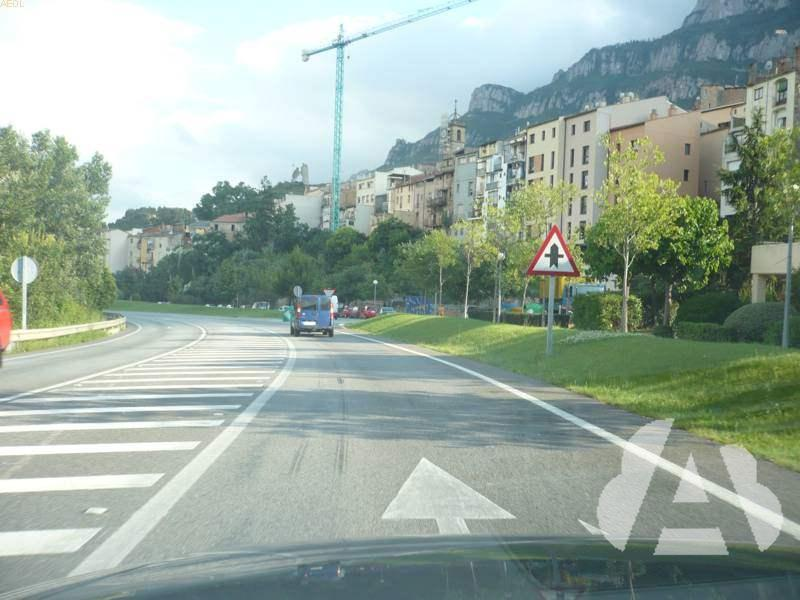
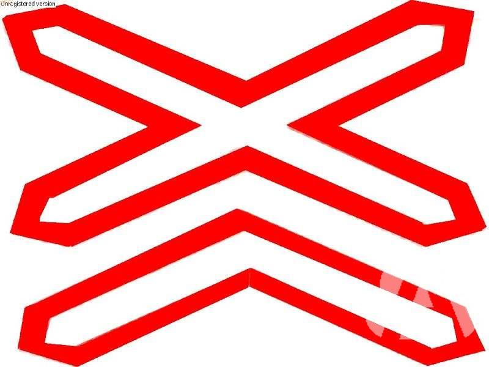

## LA SEÑALIZACIÓN

### agente

**En los casos que no existan agentes de la circulación o para ayudar a éstos...**

El **personal de obras** en la vía y el de **acompañamiento de vehículos de transporte especial**, podrán regular el paso, debiendo los conductores obedecer sus indicaciones.

Las **patrullas escolares** podrán “invitar” a los usuarios de la vía a que detengan su marcha.

**En ambos casos**, utilizarán las señales verticales incorporadas a una paleta.

La Policía Militar podrá regular la circulación. Cuando las Fuerzas y Cuerpos de Seguridad del Estado, establezcan controles policiales de seguridad ciudadana en la vía pública, podrán regular el tráfico exclusivamente en el caso de ausencia de agentes de circulación.

Tanto los agentes que regulen la circulación como la Policía Militar, el personal de obras y el de acompañamiento de los vehículos en régimen de transporte especial, que regulen el paso de vehículos y, en su caso, las patrullas escolares, el personal de protección civil y el de organizaciones de actividades deportivas o de cualquier otro acto, deberán utilizar prendas de colores llamativos y dispositivos o elementos retrorreflectantes que permitan a los conductores y demás usuarios que se aproximen distinguirlos a una distancia **mínima de 150 metros**.

	La policía y el personal de obras ¿están obligados a llevar una prenda o chaleco reflectante?

**Sí, tanto de día como de noche.**

## LAS SEÑALES (NORMAS GENERALES)

Las obras que dificulten la circulación, deben estar señalizadas tanto de día como de noche y balizadas luminosamente durante las horas nocturnas o cuando las condiciones meteorológicas o ambientales lo exijan.

En los tramos donde se estén realizando **obras**, serán **de color amarillo las marcas viales y el fondo de algunas señales** de advertencia de peligro, de reglamentación **y todas las señales de carriles y de orientación** (su **significado será el mismo** que las que se utilizan cuando no hay obras).

En las obras de reparación, los vehículos, caballerías y el ganado, marcharán por el lugar señalado. Además, los vehículos que encuentren a otro esperando en su sentido, deberán colocarse detrás de él, arrimados al borde derecho y esperar a que avance.

### luz verde

**Luz verde fija** en forma de peatón en marcha, **indica** que **pueden comenzar a cruzar** la calzada.

**Luz verde intermitente** en forma de peatón en marcha, **indica que el tiempo** que tienen **para terminar de cruzar** la calzada **está a punto de finalizar** y que se va a encender la luz roja.

Una **luz verde no intermitente significa que está permitido el paso con prioridad, salvo** que la situación de la circulación sea tal, **que previsiblemente** el vehículo **pueda quedar detenido en una intersección, paso para peatones o para ciclistas**, de forma que impida u **obstruya la circulación** transversal de sus usuarios.

**Los** vehículos **que avancen siguiendo la indicación de una flecha verde, deben hacerlo con precaución, cediendo el paso a los vehículos que circulen por el carril al que se incorporen y sin poner en peligro a los peatones que estén cruzando** la calzada.

**Cualquier vehículo que** al encenderse la flecha verde, **se encuentre en el carril que tengan que utilizar otros vehículos para avanzar en la dirección y sentido indicado por la flecha, deberá avanzar en dicha dirección y sentido** (si en la suya no es posible) aunque no fuera la dirección que deseaba tomar.

	Las indicaciones de este semáforo están dirigidas a...

**peatones exclusivamente.**

	El conductor de este turismo pretende seguir recto pero los vehículos situados detrás de él quieren girar a la derecha, ¿qué debe hacer?

**Girar a la derecha**

### luz amarilla 

Una **luz amarilla intermitente**, o dos luces alternativamente intermitentes, **obligan a extremar** la **precaución**.

- **Además**, no eximen de la obligación de ceder el paso, en los casos que corresponda y, de **cumplir con otras señales que obliguen a detenerse**.

Una **luz amarilla no intermitente significa que** los vehículos **deben detenerse en las mismas condiciones que si se tratara de una luz roja fija, a no ser que**, cuando se encienda, **el vehículo esté tan cerca del lugar de detención que no pueda detenerse** antes del semáforo **en condiciones de seguridad** suficientes.

	Ante esta situación con un semáforo en amarillo intermitente, ¿qué debe hacer?

**Detenerme para dejar pasar al peatón y luego reanudar la marcha.**

### luz roja 

Una **luz roja intermitente**, o dos luces rojas alternativamente intermitentes, **prohíben temporalmente el paso** a los vehículos.

- Estos semáforos **se encuentran** antes de un **paso a nivel, una entrada a un puente móvil o a un pontón transbordador**, **en** las proximidades de **una salida de vehículos de extinción de incendios** o con motivo de la aproximación de una aeronave a escasa altura.

Una **luz roja no intermitente prohíbe el paso**. Mientras está encendida, **obliga a detenerse sin rebasar el semáforo ni**, si existe, **la línea de detención anterior más próxima a aquél**.

**Si el semáforo está** dentro o **al lado opuesto de una intersección**, los vehículos **no deben entrar en ella ni**, si existe, **rebasar la línea de detención situada antes de la misma**.

### semáforo cuadrado

**Una flecha negra sobre una luz roja o sobre una luz amarilla**, tanto si son fijas como intermitentes, **no cambian** el **significado** de dichas luces pero lo **limita** exclusivamente al **movimiento** indicado por la flecha.

**Una luz roja en forma de aspa** determina la prohibición de ocupar el carril indicado. Los conductores de los vehículos que circulen por este carril deberán abandonarlo en el tiempo más breve posible.

**Una luz blanca o amarilla en forma de flecha fija o intermitente** **apuntando hacia abajo en oblicuo**, indica la necesidad de irse incorporando en condiciones de seguridad al carril hacia el que apunta la flecha, ya que por el carril que circula va a quedar cerrado en corto espacio.

Una **flecha verde sobre fondo circular negro significa que** los vehículos **pueden tomar la dirección y sentido indicados por la flecha**, cualquiera que sea la luz que esté simultáneamente encendida en el mismo semáforo o en otro contiguo.

**Una luz verde en forma de flecha apuntando hacia abajo**, **Indica** que está permitido circular por el carril. No obstante, **no exime** de la obligación de detenerse ante una luz roja circular o de obedecer cualquier señal o marca vial que obligue a detenerse o a ceder el paso, o, en su ausencia, del cumplimiento de las normas generales sobre prioridad de paso.

	Un semáforo cuadrado o de carril afecta...

**a los vehículos que circulan por el carril sobre el que está situado.**

	Ante un semáforo en rojo situado antes de una intersección, ¿dónde hay que detenerse?

**Ante la línea de detención anterior más próxima al semáforo y, si no existe, a la altura del semáforo, sin rebasarlo.**

## SEÑALES DE ADVERTENCIA DE PELIGRO

### **INTERSECCIÓN CON PRIORIDAD**

Peligro por la proximidad de una intersección con una vía, cuyos usuarios deben ceder el paso.

**Tienen prioridad los que encuentran la señal de frente:**

1. Intersección con prioridad **sobre vía a la izquierda**: Peligro por la proximidad de una intersección con una vía a la izquierda, cuyos usuarios deben ceder el paso. Tienen prioridad los que encuentran la señal de frente.

2. Intersección con prioridad **sobre la incorporación de la derecha**: Peligro por la proximidad de una incorporación por la derecha de una vía, cuyos usuarios deben ceder el paso.
    - No obstante, los que encuentren la señal de frente **deben facilitar la incorporación** en la medida de lo posible.

3. Intersección **con prioridad de la derecha:**Peligro por la proximidad de una intersección en la que rige la regla general de prioridad de paso.
    - Un cruce donde **tienen preferencia los que entran por la derecha.**

	¿Qué indica esta señal?

**Que me acerco a una intersección sin preferencia.**

### **SEMÁFOROS**

Peligro por la proximidad de una intersección aislada o tramo, con la circulación regulada por semáforos.

### **PROXIMIDAD DE UN PASO A NIVEL, PUENTE MÓVIL O MUELLE**

Indica, en el lado izquierdo o derecho, respectivamente, **la proximidad** de peligro señalizado de un paso a nivel, de un puente móvil o de un muelle. Esta baliza va **siempre** **acompañada** de la señal puente móvil, paso a nivel con barreras, paso a nivel sin barreras o muelle.
 

### **CERCANÍA DE UN PASO A NIVEL, PUENTE MÓVIL O MUELLE**

Indica, en el lado izquierdo y derecho, respectivamente, **la cercanía** de un paso a nivel, puente móvil o muelle, que **dista** del mismo al menos **un tercio** de la distancia entre él y la correspondiente señal de advertencia del peligro.

### **CRUCE DE TRANVÍA**

Peligro por la proximidad de cruce con una línea de tranvía, que **tiene prioridad de paso**.

### **PASO A NIVEL CON BARRERAS**

Peligro por la proximidad de un paso a nivel **provisto** de barreras o semibarreras.

### **MUELLE**

Peligro debido a que la vía desemboca en un muelle o en una corriente de agua.

### **SITUACIÓN DE UN PASO A NIVEL SIN BARRERAS DE MÁS DE UNA VÍA FÉRREA**

Peligro por la presencia inmediata de un paso a nivel sin barreras con más de una vía férrea.

### **CURVAS PELIGROSAS HACIA LA DERECHA**

Peligro por la proximidad de **una sucesión** de curvas próximas entre sí; **la primera**, hacia la derecha.

	Esta señal indica la proximidad de...

**un tramo de curvas peligrosas.**

### **PERFIL IRREGULAR**

Peligro por la proximidad de un resalto o badén en la vía o pavimento en mal estado.

**OTROS PELIGROS**

Indica la proximidad de un peligro distinto de los advertidos por otras señales.

	La señal de la derecha indica...

la proximidad de un peligro distinto de los advertidos por otras señales.
